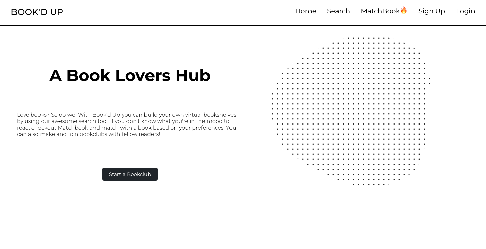
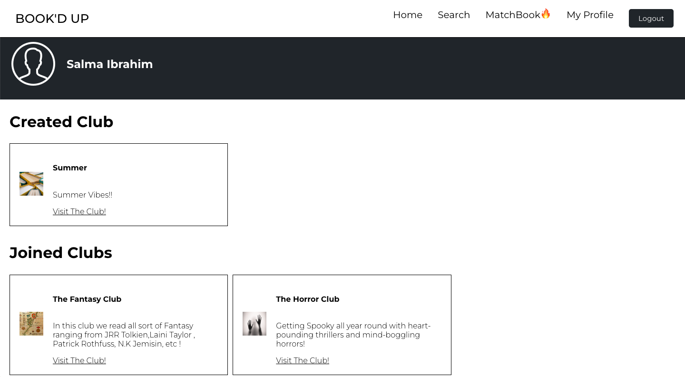
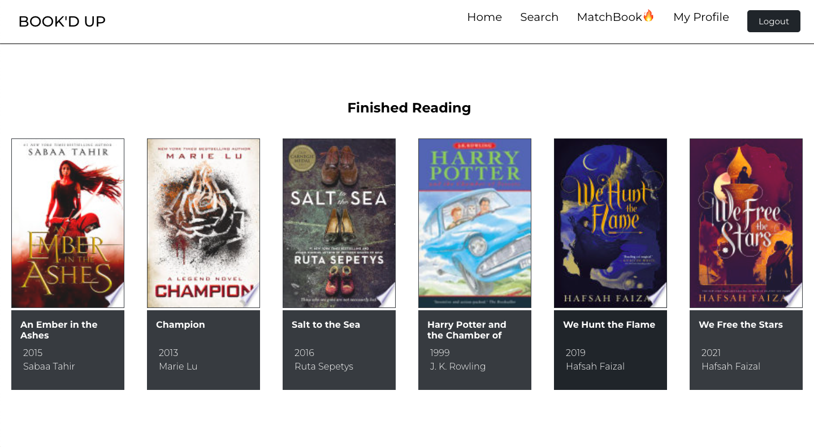
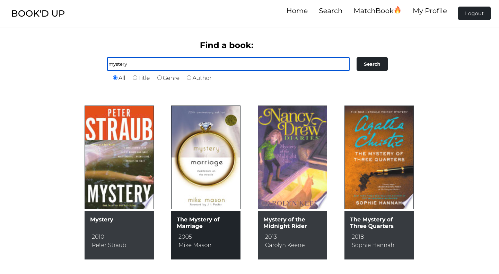
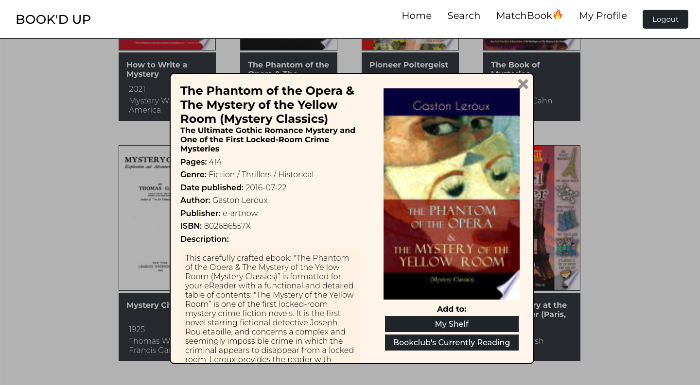
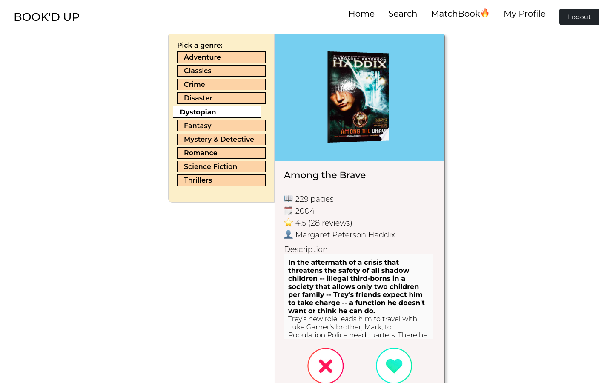
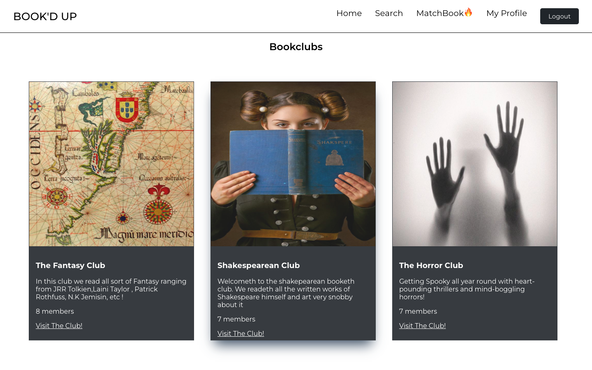

# Bookd Up

## About

Love books? So do we! With Book'd Up you can build your own virtual
bookshelves by using our awesome search tool. If you don't know what you're in the mood to read, checkout Matchbook and match with a book based on your preferences. You can also make and join bookclubs with fellow readers!

## Video and Images

### Home Page



### Clubs ive Created and Joined



### Exmaple of a Bookshelf



### Search for Books



### Bookcard full View



### MatchBook



### List of Clubs



## Running the Project

run both front end and baack end folder with:

```sh
npm start
```

## Getting started

Install all dependencies (using the `npm install` command).
Get and install the [server](https://github.com/lighthouse-labs/scheduler-api "scheduler-api server").
Run both the server and the client to start the app.

## Dependencies

- axios
- nodemon
- morgan
- react
- react-router- dom

## Dev Dependencies

- "@react-three/fiber": "^8.3.1",
- "@testing-library/jest-dom": "^5.16.5",
- "@testing-library/react": "^13.3.0",
- "@testing-library/user-event": "^13.5.0",
- "axios": "^0.27.2",
- "color-thief-react": "^2.1.0",
- "react": "^18.2.0",
- "react-dom": "^18.2.0",
- "react-router-dom": "^6.3.0",
- "react-scripts": "5.0.1",
- "sass": "^1.54.4",
- "styled-components": "^5.3.5",
- "three": "^0.143.0",
- "web-vitals": "^2.1.4"
